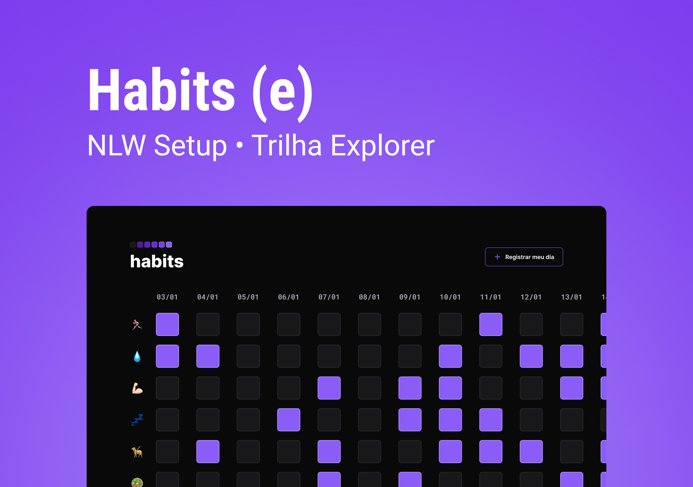

<h1 align="center"> Habits </h1>

NLW é um evento exclusivo e gratuito, promovido pela rocketseat para ensino de tecnologias WEB.  

 

  

  ## 🚀 Tecnologias

Esse projeto foi desenvolvido com as seguintes tecnologias:

- HTML e CSS
- JavaScript
- Git e GitHub
- Figma

# 💻 Projeto

O Habits é um site que serve para rastrear seus hábitos.

- [Acesse o projeto finalizado, online](https://github.com/jdassaevy/NLW-habits)

Você pode vizualizar o layout do projeto através
[DESSE LINK](https://www.figma.com/file/ZOgQxQmGfM5wvEXASs3XGm/Habits-(e)-(Community)?node-id=6%3A344&t=V8aquC760WIaTumR-0).
É necessário ter uma conta no [Figma](https://figma.com) para acessá-lo.
